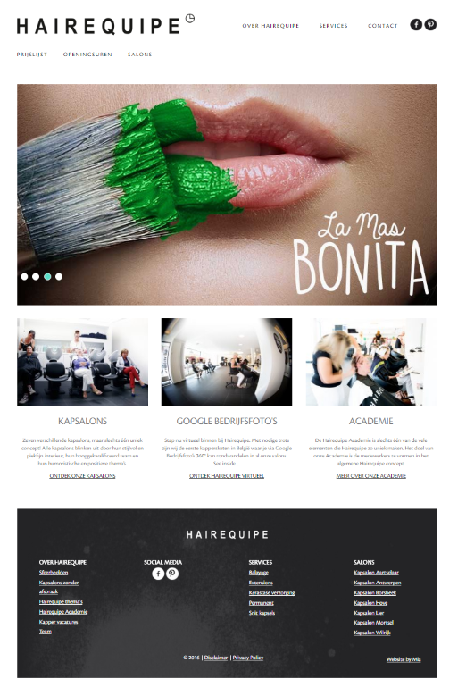

# Web-Technology - Labo 6

## Hairequipe.be: needs a new website




## Taken
* Je maakt op je computer een folder voor dit vak
* In die folder maak je een subfolder: hairequipe
* We werken de ganse les in deze subfolder
* Maak een HTML-pagina en je noemt ze default.html
* Je maakt eerst een correcte skeletversie aan voor je html bestand
* In de head sectie maak je een link naar een extern css-bestand, style.css

* We gaan werken met 3 containers: een header ```html<header>```, main (```html<div class="main">```
en een footer (```html<footer>```)
* In de header: de naam als h1 en een navigatiebalk (<nav> met <a> tags, gebruik
voorlopig het # href attribuut
* In de main: een h2 element en daaronder p-elementen. Je vult ze met tekst van
de hairequipe site. Je zorgt ook voor een afbeelding (download ze van de site:
HINT: rechts klikken en save as..). Je plaatst deze tussen h2 en de p elementen.
* In de footer: 2 divs (```html <div class="services"> ``` en```html <div class="salons">```). Daarin
telkens een ul met li elementen gevuld met links: in de lijstjes neem je
respectievelijk de services en salons over die je onderaan de hairequipe site terugvindt
(gebruik een # in de href attribuut).

* En dan: stylen naar hartelust!
* Zorg voor een "css-reset" 
* Kies een font bij http://google.com/fonts en link deze aan je html pagina
* Zorg dat de ganse pagina deze font gebruikt
* Speel met het box-model: gebruik de padding, border en margin om tot een 
mooi eindresultaat te komen.
* Geef kleur en stijl aan je pagina zoals een kapsalon het zou willen!

Be Inspired! :-)


