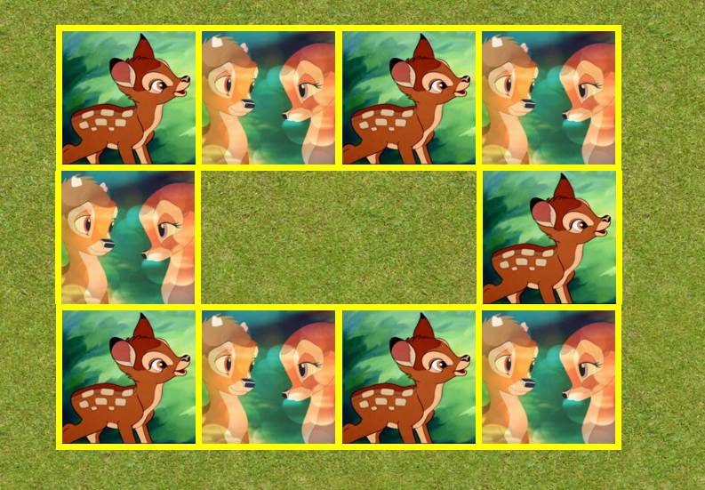
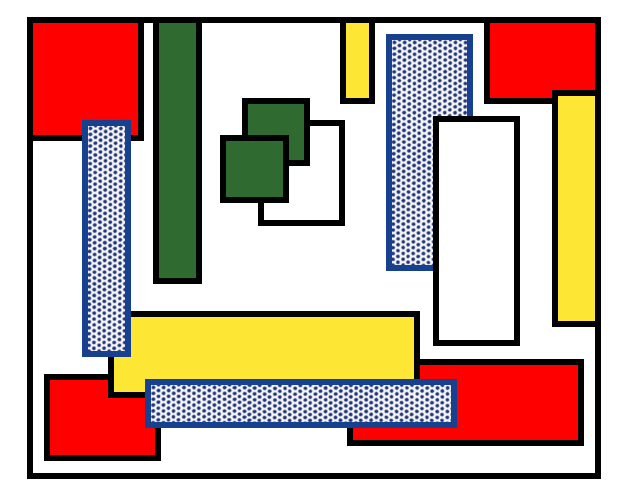
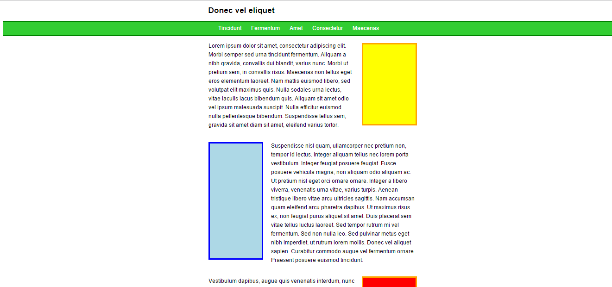

# Web-Technology - Labo 7 - 


## 4 positioning mogelijkheden: static / relative / absolute / fixed

Bekijk voorbeeld 1 en experimenteer zelf met deze positioning parameters.

### Voorbeeld 1 code

```html

<style>
	
	/* ALGEMENE CSS */

body {
    font-family: helvetica;
    font-size: 100%;
    margin: 50px auto 50px auto;
    width: 1000px;
}

h1 {
    margin: auto;
    text-decoration: underline;
    font-size: 1.4em;
    text-align: center;
}

h2 {
    margin: 2em auto;
    text-align: center;
    text-decoration: underline;
    font-size: 1.2em;
}

p {
    text-align: center;
    margin-bottom: 25px;}

.fixed {
    width: 120px;
    height: 50px;
    background: limegreen;
    border: 5px solid green;
    position: fixed;
    top: 10px;
    right: 10px;
    z-index: 500;
}

.fixed p {
    color: white;
    padding-top: 15px;
}

/* Voorbeeld 1 */

.voorbeeld1 .kader {
    width: 800px;
    height: 500px;
    margin: auto;
    border: 1px solid red;
}

.voorbeeld1 .vierkant {
    background-color: lightblue;
    width: 150px;
    height: 150px;
    position: relative;
    top: 300px;
    left: 600px;
    border: 5px solid blue;
}

.voorbeeld1 .cirkel {
    background-color: tomato;
    width: 150px;
    height: 150px;
    position: relative;
    top: -10px;
    left: 350px;
    border-radius: 50%;
    border: 5px solid red;
}

.voorbeeld1 .rechthoek {
    background-color: yellow;
    width: 250px;
    height: 150px;
    position: relative;
    border: 5px solid orange;
    top: -125px;
    left: 35px;
}

/* Voorbeeld 2 */

.voorbeeld2 .kader {
    width: 800px;
    height: 500px;
    margin: auto;
    border: 1px solid red;
    position: relative;
}

.voorbeeld2 .vierkant {
    background-color: lightblue;
    width: 150px;
    height: 150px;
    position: absolute;
    top: 300px;
    left: 50px;
    border: 5px solid blue;
}

.voorbeeld2 .cirkel {
    background-color: tomato;
    width: 150px;
    height: 150px;
    position: absolute;
    top: 25px;
    left: 550px;
    border-radius: 50%;
    border: 5px solid red;
}

.voorbeeld2 .rechthoek {
    background-color: yellow;
    width: 250px;
    height: 150px;
    position: absolute;
    border: 5px solid orange;
    top: 300px;
    left: 500px;
}
	
</style>
	</head>

	<body>
		
		<h1>CSS Positioning patronen</h1>

<div class="fixed">
    <p>Ik ben fixed!</p>
</div>

<h2>4 positioning mogelijkheden: static / relative / absolute / fixed</h2>

<div class="voorbeeld1">
    <h2>Voorbeeld 1: relatieve positioning</h2>
    <div class="kader">
        <div class="vierkant">
        </div>
        <div class="rechthoek">
        </div>
        <div class="cirkel">
        </div>
    </div>
</div>

<div class="voorbeeld2">
    <h2>Voorbeeld 2: absolute positioning</h2>
    <div class="kader">
        <div class="vierkant">
        </div>
        <div class="rechthoek">
        </div>
        <div class="cirkel">
        </div>
    </div>
</div>

</body>

```


## Oefening 1

Schrijf CSS code om tot de juiste oplossing te komen.
Gegeven:

De HTML code

```html

		<div class="eerste">
    
    
    
    
</div>

<div class="tweede">
    
    
</div>

<div class="derde">
    
    
    
    
</div>

```

Eindresultaat:


## Oefening 2

Werk met de positioning parameters om tot dit abstract resultaat te komen:



## Oefening 3

Schrijf CSS code voor onderstaande website (gegeven is de HTML code):
Extra restrictie: voor het positioneren werk je enkel met de positioning parameter en niet
met floats!

```html

	<h1>Donec vel eliquet</h1>
<div class="banner">
    <ul>
        <li><a href="#">Tincidunt</a></li>
        <li><a href="#">Fermentum</a></li>
        <li><a href="#">Amet</a></li>
        <li><a href="#">Consectetur</a></li>
        <li><a href="#">Maecenas</a></li>
    </ul>
</div>
<div class="text">
        <div class="afb1"></div>
        <p class="eerste">Lorem ipsum dolor sit amet, consectetur adipiscing elit. Morbi semper sed urna tincidunt fermentum. Aliquam a nibh gravida, convallis dui blandit, varius nunc. Morbi ut pretium sem, in convallis risus. Maecenas non tellus eget eros elementum laoreet. Nam mattis euismod libero, sed volutpat elit maximus quis. Nulla sodales urna lectus, vitae iaculis lacus bibendum quis. Aliquam sit amet odio vel ipsum malesuada suscipit. Nulla efficitur euismod nulla pellentesque bibendum. Suspendisse tellus sem, gravida sit amet diam sit amet, eleifend varius tortor.</p>
        <div class="afb2"></div>
        <p class="tweede">Suspendisse nisl quam, ullamcorper nec pretium non, tempor id lectus. Integer aliquam tellus nec lorem porta vestibulum. Integer feugiat posuere feugiat. Fusce posuere vehicula magna, non aliquam odio aliquam ac. Ut pretium nisl eget orci ornare ornare. Integer a libero viverra, venenatis urna vitae, varius turpis. Aenean tristique libero vitae arcu ultricies sagittis. Nam accumsan quam eleifend arcu pharetra dapibus. Ut maximus risus ex, non feugiat purus aliquet sit amet. Duis placerat sem vitae tellus luctus laoreet. Sed tempor rutrum mi vel fermentum. Sed non nulla leo. Sed pulvinar metus eget nibh imperdiet, ut rutrum lorem mollis. Donec vel aliquet sapien. Curabitur commodo augue vel fermentum ornare. Praesent posuere euismod tincidunt.</p>
        <div class="afb3"></div>
        <p class="derde">Vestibulum dapibus, augue quis venenatis interdum, nunc enim fermentum erat, at congue felis diam ac neque. In vulputate leo nisl, quis accumsan felis interdum id. Integer nec tellus in nibh rutrum pellentesque. Nunc ac ornare velit, id semper lacus. Nunc rhoncus bibendum turpis, ac dictum eros interdum dignissim. Quisque finibus pretium tristique. Curabitur diam magna, pretium eget justo eu, mattis maximus nisi. Etiam ut scelerisque dui, ac sagittis purus. Quisque consequat congue blandit. Quisque non nisi quis massa maximus pulvinar. Proin tempor eget purus eget vulputate. Proin interdum vehicula velit, vel gravida odio mattis sit amet.</p>
        <div class="afb4"></div>
        <p class="vierde">Praesent iaculis felis ac libero egestas, eu feugiat velit faucibus. Integer accumsan ultrices laoreet. Vestibulum pretium felis erat, vitae blandit elit suscipit sodales. Nulla id leo ut quam hendrerit fermentum. Mauris id aliquam erat. Pellentesque molestie euismod tempor. In ac odio ut dolor mattis rutrum. Nulla in tempus sem. Curabitur dictum vestibulum justo ac ultrices. Cras non magna convallis, ultricies dolor nec, rutrum libero.</p>
</div>


```



"Naar onder scrollen levert dit resultaat op:


