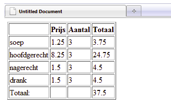

# Web-Technology - Javascript Labo 1

### 1. Welke standaard gegevenstypen bestaan er in javascript?

### 2. Wat zal de waarde van de variabele resultaat_1 en resultaat_2 in het volgende stukje programma zijn? 

```html

var x=13; 
var y = 7; 
var resultaat_1; 
var resultaat_2; 
resultaat_1 = x/y; 
resultaat_2 = x%y; 

```


### 3. Wat is na afloop de waarde van som? 

```html

var x=3; 
var y = 5; 
var som = 100; 
x++; 
y+=5; 
som+=x; 
som+=y; 

```

### 4. Schrijf een script met daarin een variabele voor het aantal maanden per jaar, 
en twee variabelen voor het maandsalaris en het jaarsalaris. 
Laat het script aan de gebruiker vragen om invoer van een maandsalaris 
(gebruik prompt). De uitvoer op het scherm moet het jaarsalaris zijn. 

### 5. Definieer in een programma het percentage btw als 21%. 
Laat het programma vragen om de prijs van een artikel zonder BTW en 
de prijs inclusief BTW op het scherm te zetten.  

### 6.  De toegansprijs voor de dierentuin bedraagt 15 euro voor volwassenen 
en 10 euro voor kinderen tot 12 jaar. Maak een script waarbij de gebruiker 
het aantal kinderen en volwassene kan ingeven. Het programma moet het totaal 
te betalen bedrag berekenen. 

### 7. Een plaatselijke scoutsvereniging organiseert een eetweekend. 
Zij bieden een aantal gerechten en dranken aan. Om het aantal telfouten aan de kassa te verkleinen 
wordt een script geschreven. Het script berekent per tafel de totale prijs. De prijzen
 voor soep, hoofdgerecht, nagerecht en drank zijn vast gedeclareerd. De kassier moet 
enkel aan het script meegeven hoeveel soep, hoofdgerecht, drank en nagerecht genomen 
zijn. Vervolgens wordt het totaal uitegerekend, en wordt alles mooi in een tabel 
gezet. (zie screenshot)





