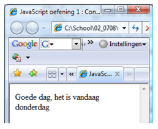

# Web-Technology - Javascript Labo 2

### 1.  Controle structuren en datums

Schrijf een script dat een welkoms zinnetje toont rekening houdend met de huidige dag en tijd. Al naargelang het tijdstip moet een van de volgende teksten verschijnen. Bovendien moet de weekdag getoond worden. 

```html

var dtVandaag = new Date();
var intUur = dtVandaag.getHours();
var intWeekDag = dtVandaag.getDay();

```




### 2. De gebruiker geeft een getal in tussen 1 en 10 (via prompt). Het programma plaatst op de eerste regel 1 sterretje, op de tweede regel 2 sterretjes,... Het aantal regels wordt aangegeven door het getal dat de gebruiker heeft opgegeven. Indien de gebruiker een getal ingeeft kleiner dan 1 of groter dan 10 krijgt hij een foutboodschap.

### 3. Maak een script dat alle cijfers van 1 tot 20 schrijft per 5 in 1 rij. Dus output een HTML table met een border van 1. Verder zorg je ervoor dat de even rijen een bepaalde kleur krijgen en de oneven een andere.


### 4. Maak een script waarin een gegeven woordt (vb. var woord = bankkaarten) vertikaal getoond wordt (alle letters onder elkaar). 

TIP. Met een for-lus kan je doorheen een woord navigeren (for var i=0;i<woord.length;i++). 
Met charAt(getal) kan je de xde letter van een woord grijpen

### 5. Maak een script die een gegeven woord op elk van de volgende manieren schrijft:

´´´html

BRUSSEL <br>
BRUSSE <br>
BRUSS <br>
BRUS <br>
BRU <br>
BR <br>
B <br>

´´´

