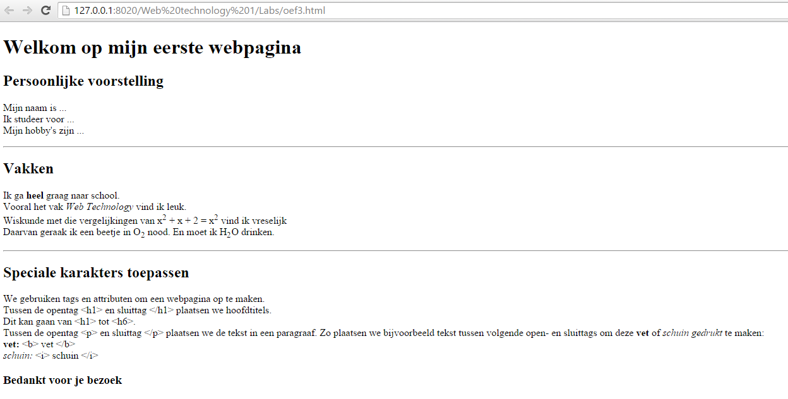

# Web-Technology - Labo 2

Download en installeer XAMPP:

https://www.apachefriends.org/index.html

1. Start je XAMPP Controle Panel en start Apache (dit is je lokale web server) 
2. Zoek de folder waar je xampp hebt geinstalleerd en zoek naar de htdocs folder.
3. Maak een html bestand met tekst in en bewaar in de htdocs folder. 
3. Open de browser en ga naar http://localhost/tom.html (indien je de naam tom.html hebt gekozen)
4. Beschrijf wat je net gesimuleerd hebt.

## Oefening

Kopieer onderstaande code tussen je body-tags:
<h1> </h1>
	
	
	
	

	
	

	
En vul verder aan zodat je je eigen homepage gemaakt heb die er ongeveer zo uit ziet (bij de beschrijving schrijf je waarom je voor Elektronica-ICT hebt gekozen, wat je verwachtingen zijn, welke IT skills je momenteel bezit,...):

## HTML Debugging

Zowel in Chrome als IExplorer kan je met de toets F12 een debugger window openen. Debugging is het zoeken naar fouten, en deze tools kunnen je hierbij helpen

## Maak na:

## DOM structuur

Ga naar een website naar keuze en maak de boomstructuur. Zet daarna de boomstructuur om in code.
(Kan je niet direct een site vinden, maak vb. gebruik van http://hairequipe.be/ )

