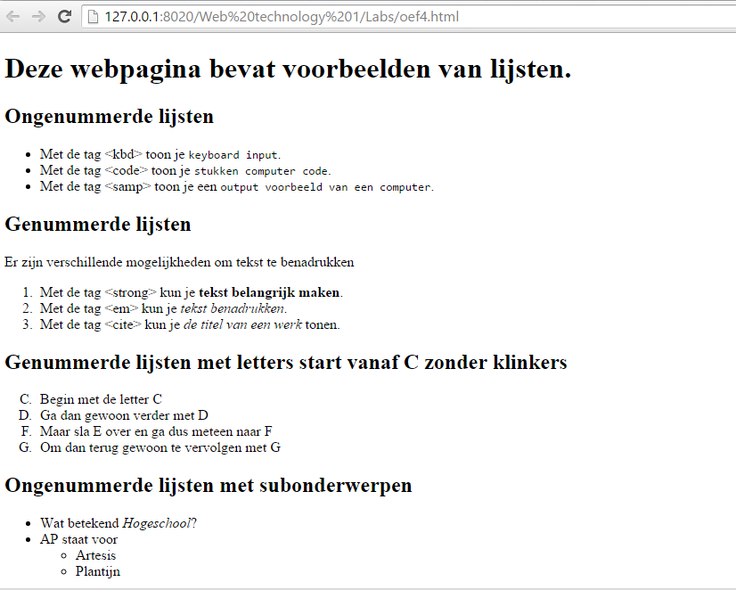
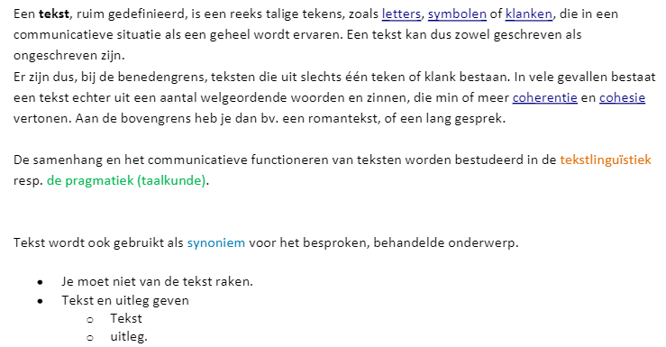
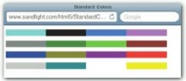
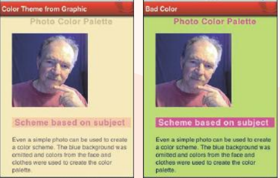

# Web-Technology - Labo2
## Verbeter onderstaande web pagina
```html
<! >
<html lang= >
	<head>
		<!-- Color Combination
		0B0B0D,29272A,A99A93,E27107,F8AC00 -->
		<style type=”text/css”>
			body {
				background-color: #F8AC00;
				color: #29272a;
				font-family: Verdana, Geneva, sans-serif;
				font-size: 12px;
				margin-left: 20px;
			}
			h1 {
				color: #29272A;
				font-family: ”Arial Black”, Gadget, sans-serif;
			}
			h2 {
				text-indent: 10px;
				color: #0B0B0D;
				background-color: #E27107;
				font-family: ”Trebuchet MS”, Arial, Helvetica, sans-serif;
			}
			header {
				text-align: center;
			}
		</style>
		<title>==???===</title>
		< >
		<body>
			<header>
				< >My Favorite Things</h1>
			</header>
			<section>
				<h2>My Favorite Music</h2>
				==????==
				<br/>
				==????==
				<br/>
				==????==
				<br/>
				< >My Favorite Movies</h2>
				==????==
				<br/>
				==????==
				<br/>
				==????==
				<br/>
				<h2>My Favorite Computers</h2>
				==????==
				<br/>
				==????==
				<br/>
				==????==
				<br/>
				<h2>My Favorite TV</h2>
				==????==
				<br/>
				==????==
				<br/>
				==????==
				<br/>
				< >
				< >
				<h5>Not responsible for my tastes.
				<br/>
				Take it or leave it.< >
				</footer>
		</body>
</html>

```
## Oefening

Maak na:


## Oefening

Maak na:



## oefening

In deze oefening je je kennis over tekst, kleur, lijsten, hyperlinks  in HTML moeten aanspreken.  
Probeer gewoon onderstaande tekst zo goed mogelijk na te bouwen: met de lijst, de kleuren, hyperlinks,...




## a kid's page challenge

Bouw de structuur van 'a kid's page' na. Na de structuur tracht 
je de html pagina te designen. Denk aan volgende items: design voor kinderen, fonts,
positionering elementen,...


## Reproduceer de standard color chart. 

Maak onderstaande afbeelding na met HTML:



## Kleur design

Zie onderstaand voorbeeld voor een juist en fout kleurenschema. Wil je meer te 
weten komen over kleurenschema's: leslie cabarga designers guide to color combinations 
bevat een hoofdstuk over slechte kleuren.



Om een goed kleurenschema te maken kan je ten rade bij Kuler: https://color.adobe.com/nl/
Kuler is een website waarbij je een basiskleur suggereert en je een kleurenpalet teruggeeft.


Maak een digitale foto van jezelf en upload je foto naar Kuler om een 
kleurenpalet aan te maken. Gebruik deze kleuren om een web pagina over jezelf aan te maken.


