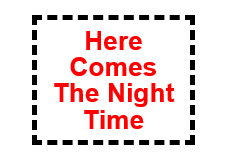
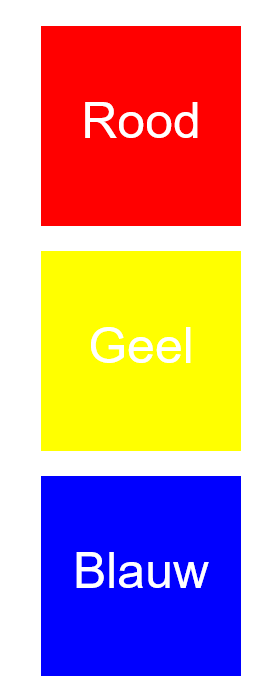
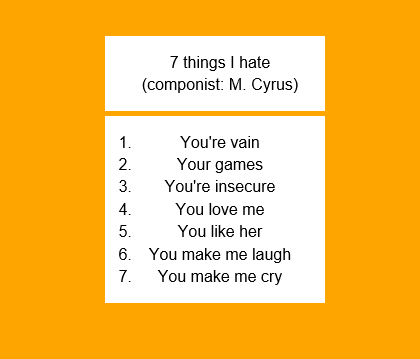
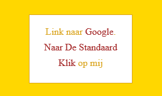
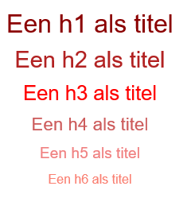
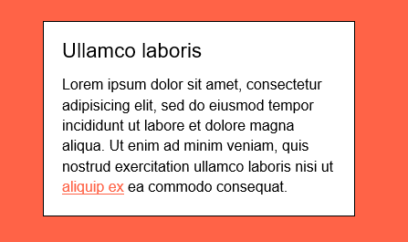

# Web-Technology - Labo4

## Labo CSS - intro

1. Experimenteer met het box-model. Maak een p-element aan en zet er tekst in.
Pas de waarden border, margin en padding aan. Gebruik pseudo klassen om de
kleuren te inverteren wanneer je over het element beweeegt met je muispijl.

2. Maak na:

3. Maak een h1 en een geordende lijst aan zoals op het eindresultaat te zien
 is. Werk met beide elementen om via css tot het gewenste resultaat te komen

4. Je maakt een lijst (ul) met daarin 3 elementen (li) die telkens een link 
bevatten (a). Neem de zinnen over die je ziet in het eindresultaat 
en plaats de link over het juiste woord(en). In CSS style je de lijst 
zoals in het eindresultaat. Gebruik de pseudo-klasses :hover en :visited 

5. Maak een aantal header-tags aan in HTML. Gebruik daarbij h1 tot en met h6.
 Daarna kies je gebruik makend van CSS een font-family en geef je een grootte
 (in em) en kleur aan elke header. Zoek op wat em wil zeggen.

6. Creëer een div (.kader) met daarin een h1-tag en een paragraaf. 
Geef .kader een width en een height, en positioneer via margin.
 Style de tekst. Geef body een achtergrond-kleur.

