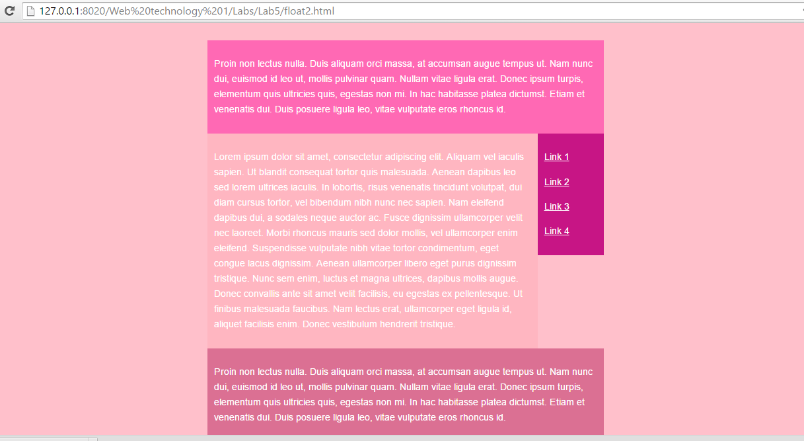
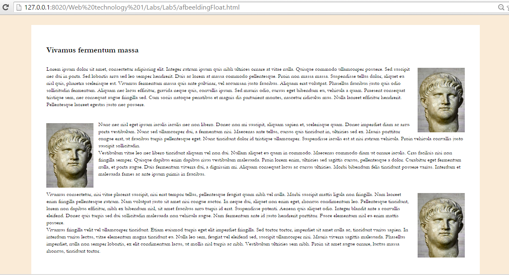
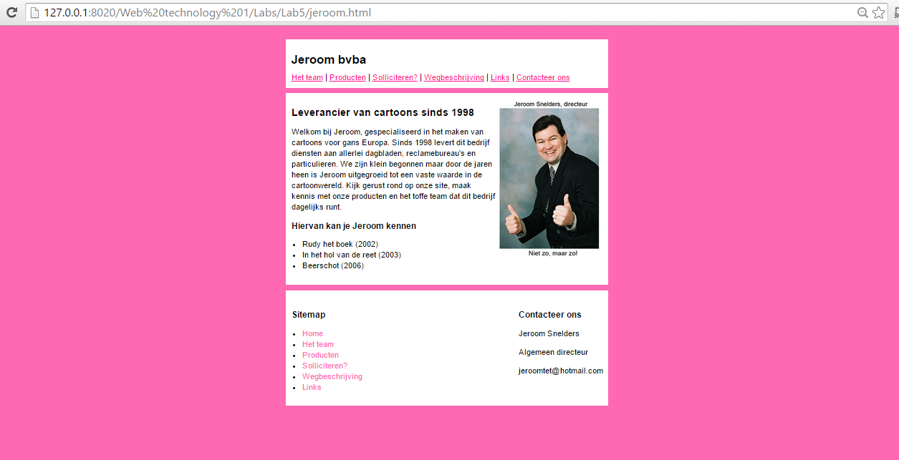

# Web-Technology - Labo 5 - 

## Float 1

1. Werk met lipsum-tekst. Maak 3 divs: .linkerkolom, .rechterkolom, .footer. 
Werk met floats om het hier weergegeven eindresultaat te bekomen. 
Zorg dat de footer gecleared wordt indien nodig.

2. Maak na (CSS floating & clearing:

3. floaten van afbeeldingen links en rechts van een tekst:
In deze oefening maak je een div met klasse ".kader". Je geeft deze 
een breedte van 40% en centreert. Binnen deze div plaats je 3 paragrafen 
lipsum-tekst met telkens een afbeelding. Je werkt met float om de afbeelding
 bij de eerste paragraaf rechts te plaatsen, bij de 2de paragraaf links
 en bij de 3de paragraaf terug rechts.

4. Voorzie de site van Jeroom van styling op de manier waarop het hier 
werd gedaan. Vertrek van de HTML en voeg zelf de CSS toe.

