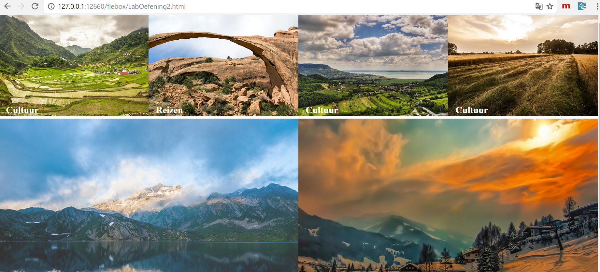
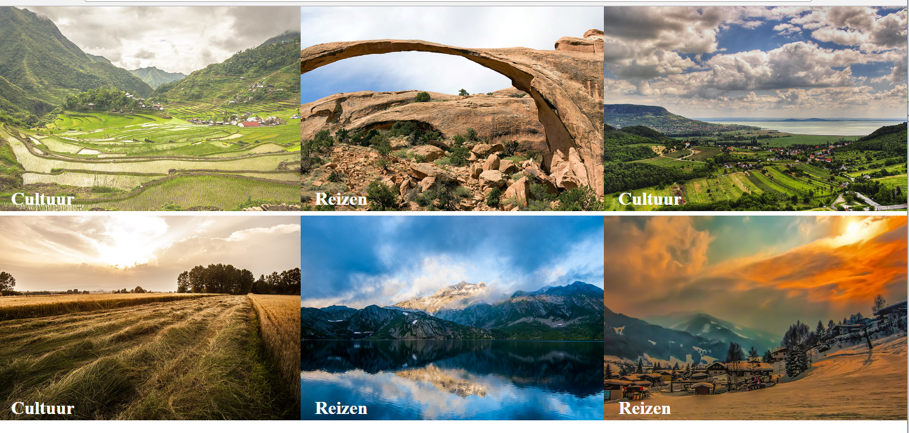
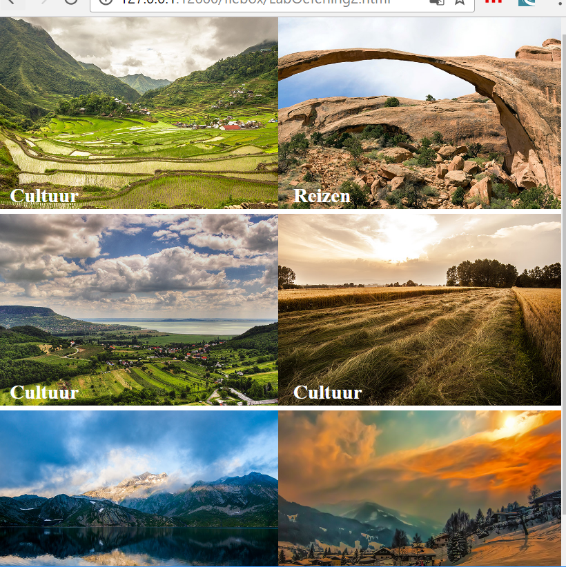
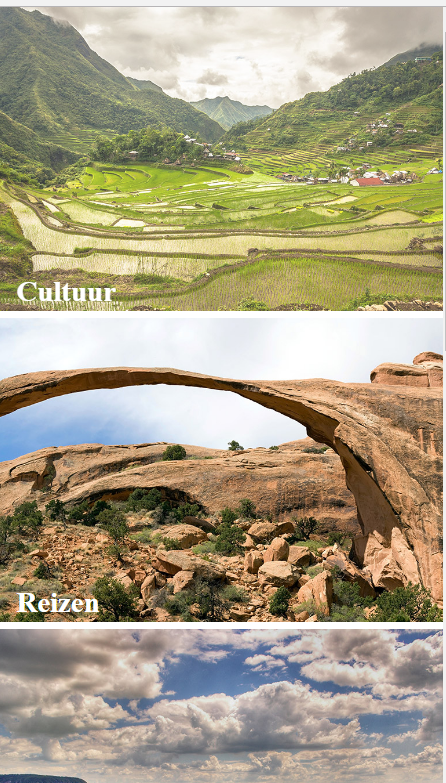
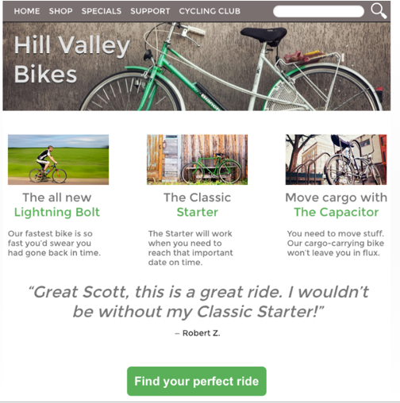
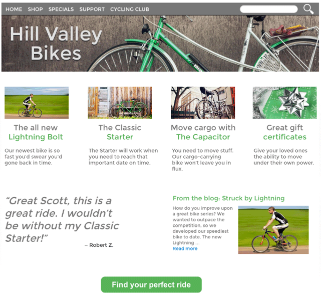

# Web-Technology - Labo RWD - 


## Oefening 

De basis code:

Maak een responsive website waarbij de kubus onzichtbaar is bij een schermgrootte groter 
dan 1200px. Bij kleinere schermgroottes is de kubus zichtbaar, maar verandert van kleur
en grootte. Bij volgende schermgroottes wil ik een verandering zien:
800 px, 620px, 520px, 420px en 320px.

Zorg ook voor een responsive font, zodat je bij schermen van 520,420 en 320 de fontsize
aanpast.

```html

	body {
      background-color: lightgrey;
      
}

.kubus {
      width: 600px;
      height: 600px;
      background-color: yellow;
      margin: 50px auto 10px auto;
}

p {
      width: 500px;
      margin: auto;
      text-align: center; 
      font-family: helvetica;
      color: #888;
      font-size: 0.8em;
}

h2 {
      font-family: helvetica;
      font-size: 2em;
      margin: 150px auto;
      width: 90px;
      text-align: center;
      display: none;
}

```

De html code:

```html

<body>

		<div class="kubus"></div>
		<h2>Game Over :-)</h2>
		<p>
			* Ik ben responsive. Ontdek het door het scherm kleiner en groter te maken
		</p>

	</body>

```

## Oefening

Maak gebruik van de CSS3 flexbox eigenschap en onderstaande HTML code om foto's een minimum grootte van 250px
te geven. Indien er ruimte over is, worden de foto's groter. Als bijvoorbeeld je scherm 1000px breed is, kunnen er exact 4 foto's op de eerste rij staan, de overige 2 foto's (je toont er 6), worden op de 2de rij getoond, maar dan groter dan de 250px ( zie screenshot 1)

```html

<body>
    
    
    <div id="container">
      <ul id="flex-container">
        <li><a href="#"><span>Cultuur</span></a></li>
        <li><a href="#"><span>Reizen</span></a></li>
        <li><a href="#"><span>Cultuur</span></a></li>
        <li><a href="#"><span>Cultuur</span></a></li>
        <li><a href="#"><span>Reizen</span></a></li>
        <li><a href="#"><span>Reizen</span></a></li>
      </ul>
    </div>
    
    
</body>

```



Als je scherm kleiner wordt, komen er minder foto's op de rijen te staan:




Vanaf je scherm kleiner is dan 480px (Mobiele devices), mogen de foto's maximum 200px groot zijn. Dus 2 foto's op één rij. Indien je scherm kleiner wordt dan 400px kan er slechts 1 foto getoond worden:




Wanneer een afbeelding geselecteerd wordt verander je de opaciteit, wat zorgt voor een leuk effect. 

# Oefening

Maak volgend responsive design:

## Mobile First


Mobile first laat ons nadenken over datgene wat echt belangrijk is. In de smartphone view, de best verkochte fiets en het nieuwste model moeten leiden naar onmiddellijke verkoop. Zaken zoals cadeaubonnen, minder populaire fietsen, laatste nieuws kunnen in andere pagina’s gezet worden.

Onderaan hebben we een grote groene knop voorzien om de gebruiker tot actie te laten overgaan door een single tap.

## Tablet View



Voor de tablet view hebben we meer mogelijkheden om tweederangs informatie te tonen. Ook kunnen we de navigatie bovenaan over de totale breedte laten zien, en inhoud toevoegen zoals een getuigenis, om verkoop aan te moedigen.  Je moet er voor zorgen dat je nog geen overload aan info weergeeft, want de verleiding is groot om ook al derderangs info te tonen (hou dit voor de desktop view)

## Desktop View

