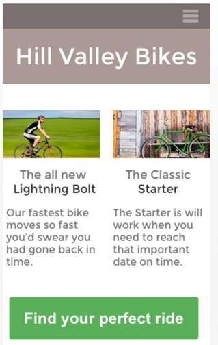
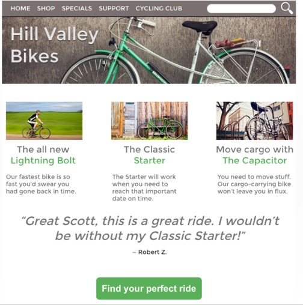
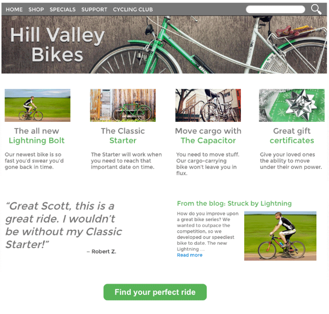

# Web-Technology - Labo RWD - 

# Oefening

Maak volgend responsive design:

## Mobile First

Mobile first laat ons nadenken over datgene wat echt belangrijk is. In de smartphone view, de best verkochte fiets en het nieuwste model moeten leiden naar onmiddellijke verkoop. Zaken zoals cadeaubonnen, minder populaire fietsen, laatste nieuws kunnen in andere pagina’s gezet worden.

Onderaan hebben we een grote groene knop voorzien om de gebruiker tot actie te laten overgaan door een single tap.

## Tablet View

Voor de tablet view hebben we meer mogelijkheden om tweederangs informatie te tonen. Ook kunnen we de navigatie bovenaan over de totale breedte laten zien, en inhoud toevoegen zoals een getuigenis, om verkoop aan te moedigen.  Je moet er voor zorgen dat je nog geen overload aan info weergeeft, want de verleiding is groot om ook al derderangs info te tonen (hou dit voor de desktop view)

## Desktop View

