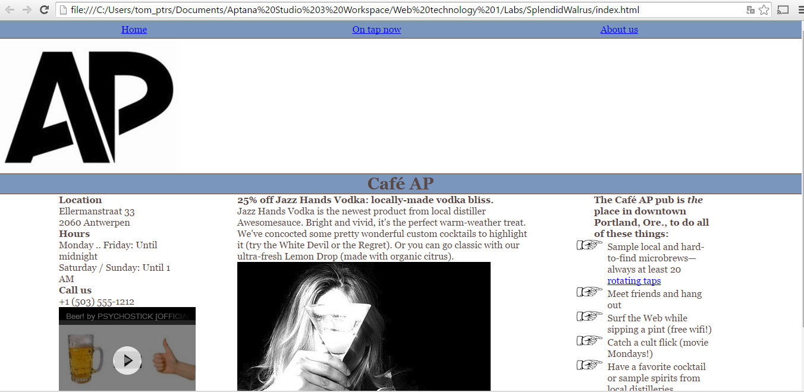

# Web-Technology - Labo 8 - responsive

Bouw website na zoals onderstaande schreenshot, maar zorg ook voor een responsive design. 
Bedenk welke content je wil laten zien bij kleinere schermen, en hoe je de content
wil positioneren.. Bij het design van deze website maak je gebruik van een fluid layout!

